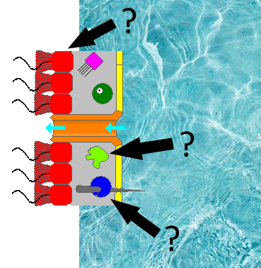

[]

* Source of Porifera cell types image: https://commons.wikimedia.org/wiki/File:Porifera_cell_types_01.png
* The original was uploaded on October 30, 2008 by Wikimedia Commons user Philcha.
* The image is dedicated to the public domain under CC0.
* The image was adapted by OneZoom content creators by inserting three black arrows, matching up with the four colored paths depicted on OneZoom. Additionally, a watery backdrop has been inserted to demarcate the outside of the sponge from the inside.
* Source of the water backdrop: https://unsplash.com/photos/a-blue-pool-with-clear-blue-water-RisKqQIPb1Q
* The original water photo was uploaded on April 23, 2023 by Unsplash user Andy Quezada.
* The image is dedicated to the public domain under the Unsplash+ License, which allows for unlimited commercial and non-commercial purposes.