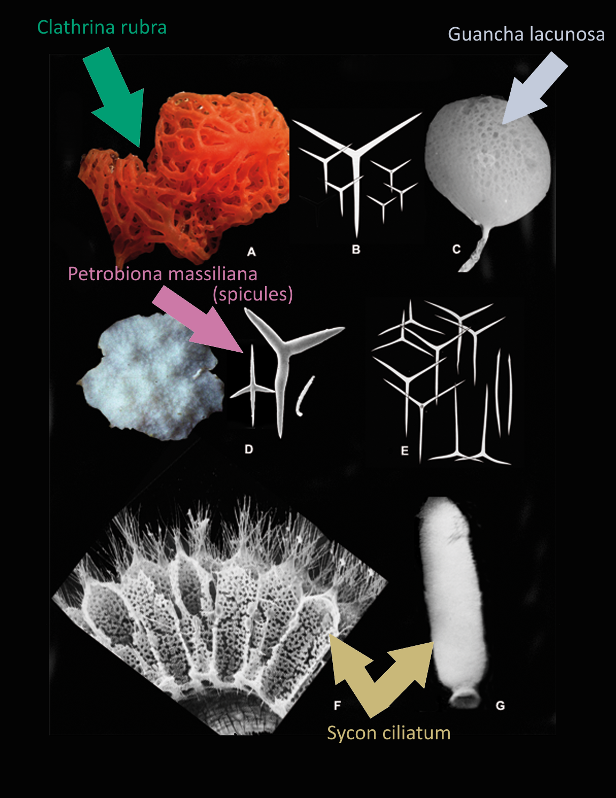

[]

* Source of Calcareous sponge spicules image: https://commons.wikimedia.org/wiki/File:Calcarea_diversity.png
* The original uploader was Van Soest et al., the team behind the 2012 study "Global Diversity of Sponges (Porifera)" (https://doi.org/10.1371/journal.pone.0035105)
* The image is licensed to the public under CC-BY-2.5.
* The image was adapted by OneZoom content creators by inserting five colored arrows, aligned with colors tracing paths leading to the species on OneZoom. Labels have been inserted to describe the species represented in the image.