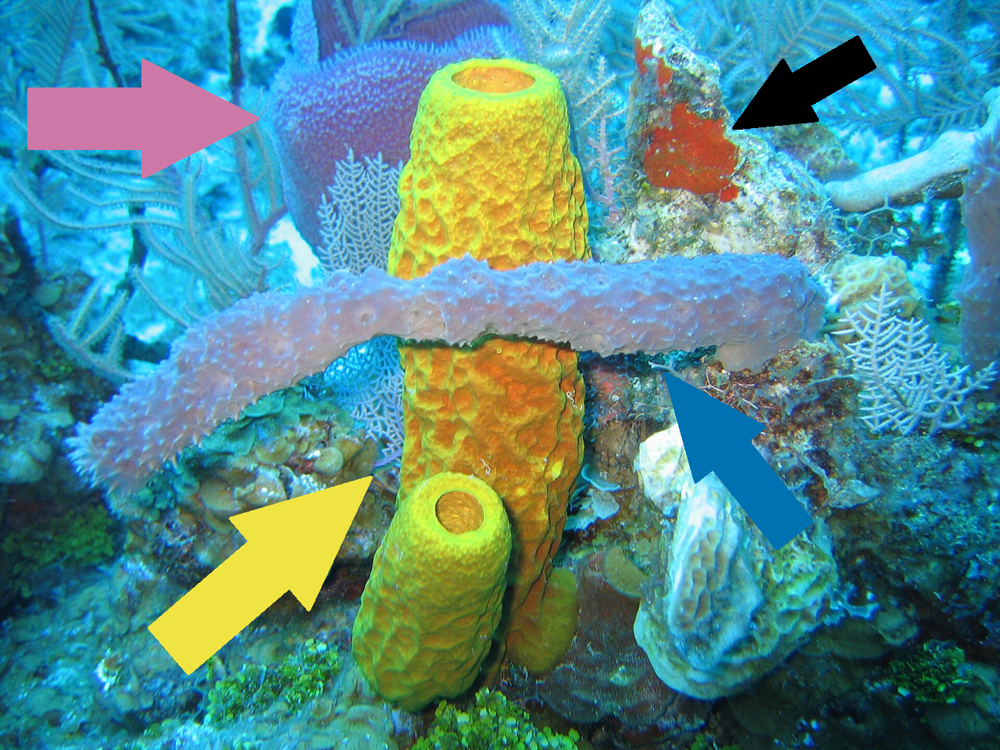

[]

* Source of Cayman Island sponge image: https://commons.wikimedia.org/wiki/File:Sponges_in_Caribbean_Sea,_Cayman_Islands.jpg
* The original uploader was the U.S. National Oceanic and Atmospheric Administration, through the Twilight Zone Expedition Team's May 23, 2007 exploration.
* The image is dedicated to the public domain under CC0.
* The image was adapted by OneZoom content creators by inserting four colored arrows, matching up with the four colored paths depicted on OneZoom.